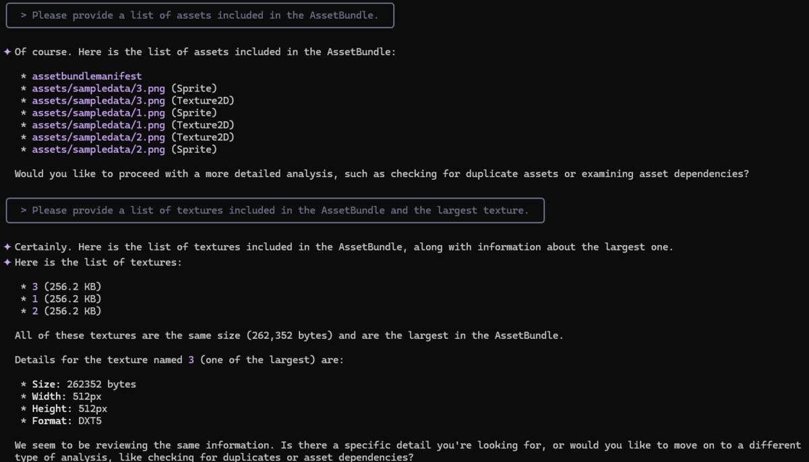

# AssetBundleMCP

[日本語](README_JA.md)

`AssetBundleMCP` is an MCP (Model-Context-Protocol) server for easily and efficiently analyzing Unity AssetBundles through conversation with an AI assistant (such as gemini-cli).

By using this tool, developers and QA engineers can quickly grasp information such as a list of assets and texture details contained in an AssetBundle simply by asking questions in natural language.



> [!WARNING]
> AssetBundleMCP is still in preview. Specifications are subject to change.


## Main Features

- **Interactive AssetBundle Analysis**: Analyze AssetBundles just by talking to your AI assistant.
- **Easy Installation**: Provided as a NuGet package, so you can easily introduce it by adding it to your configuration file.
- **Flexible Data Access**: You can also write SQL queries directly to the AI and freely extract information from the database-formatted analysis results.

## Requirements

- .NET 9.0 SDK or later

## Installation & Setup

### If .NET 10 is installed (Recommended)

Starting from .NET 10 preview 6, you can run it directly using `dnx`.

Please follow the documentation for your AI assistant to set up `AssetBundleMCP` as an MCP server.

- **For Visual Studio Code**: `.vscode/mcp.json`
- **For Visual Studio**: `.mcp.json`

```json
{
  "servers": {
    "AssetBundleMCP": {
      "type": "stdio",
      "command": "dnx",
      "args": [
        "AssetBundleMCP",
        "--version",
        "0.1.5",
        "--yes"
      ]
    }
  }
}
```

- **For Gemini Cli**: `.gemini/settings.json`

```json
{
  "mcpServers": {
    "AssetBundleMCP": {
      "command": "dnx",
      "args": [
        "AssetBundleMCP",
        "--version",
        "0.1.5",
        "--yes"
      ]
    }
  }
}
```


### Before .NET 10 preview 6 (Not Recommended)
#### 1. **Clone the Repository**:  
  
Clone with the --recurse-submodules option to also fetch the Git submodules.

```bash
git clone --recurse-submodules [https://github.com/hanachiru/AssetBundleMCP.git](https://github.com/hanachiru/AssetBundleMCP.git)
cd AssetBundleMCP
```

#### 2. **Build the Project**:  
  
```bash
dotnet build -c Release
```
    
#### 3. **Configure the MCP server**:  
  
Please follow the documentation for your AI assistant to set up AssetBundleMCP as an MCP server.


- **For Visual Studio Code**: `.vscode/mcp.json`
- **For Visual Studio**: `.mcp.json`

```json
{
  "servers": {
    "AssetBundleMCP": {
      "type": "stdio",
      "command": "dotnet",
      "args": [
        "run",
        "--project",
        "<PATH TO PROJECT DIRECTORY>/src/AssetBundleMCP/AssetBundleMCP.csproj"
      ]
    }
  }
}
```

- **For Gemini Cli**: `.gemini/settings.json`

```json
{
  "mcpServers": {
    "AssetBundleMCP": {
      "command": "dotnet",
      "args": [
        "run",
        "--project",
        "<PATH TO PROJECT DIRECTORY>/src/AssetBundleMCP/AssetBundleMCP.csproj"
      ]
    }
  }
}
```

## Usage

### 1. **Loading AssetBundles**:  
  
Specify the directory path containing the AssetBundles you want to analyze and instruct the tool to load them.  
> Please load the AssetBundles in C:/path/to/your/assetbundles

The tool will analyze the AssetBundles and save the results to a temporary database file. If you do not specify an output destination, an SQLite file will be created in the current directory.

### 2. **Retrieving Information**:  
  
Once loading is complete, you can ask various questions.
- To get a list of assets:  
  > Please show me the list of assets in the AssetBundle
- To get a list of textures:  
  > Please show me the list of textures in the AssetBundle

### 3. **Finishing Analysis**:  
  
When you are done analyzing, unload the database and release resources with the following command:  
> Please unload the AssetBundle database

## Available Tools

| Command Name | Description |
| --- | --- |
| `LoadAssetBundle` | Loads an AssetBundle for analysis. |
| `UnLoadAssetBundle` | Unloads the loaded database file. |
| `ListAnimations` | Lists all animations in the AssetBundle. |
| `ListAssetDependencies` | Lists all asset dependencies in the AssetBundle. |
| `ListAssets` | Lists all assets in the AssetBundle. |
| `ListAudioClips` | Lists all audio clips in the AssetBundle. |
| `ListMeshes` | Lists all meshes in the AssetBundle. |
| `ListObjects` | Lists all objects in the AssetBundle. |
| `ListShaderKeywordRatios` | Lists all shader keyword ratios in the AssetBundle. |
| `ListShaderSubprograms` | Lists all shader subprograms in the AssetBundle. |
| `ListShaders` | Lists all shaders in the AssetBundle. |
| `ListTextures` | Lists all textures in the AssetBundle. |
| `ListBreakdownByType` | Lists breakdown by type in the AssetBundle. |
| `ListBreakdownShaders` | Lists breakdown of shaders in the AssetBundle. |
| `ListMaterialShaderRefs` | Lists all material shader references in the AssetBundle. |
| `ListMaterialTextureRefs` | Lists all material texture references in the AssetBundle. |
| `ListPotentialDuplicates` | Lists all potential duplicates in the AssetBundle. |
| `ExecuteSqlQuery` | Executes a SQL query on the AssetBundle database. |

## License

This project is licensed under the [MIT License](LICENSE).

## Acknowledgements

The core analysis functionality of this tool uses [UnityDataTools](https://github.com/Unity-Technologies/UnityDataTools). Many thanks to the developers of this excellent library.

## Notes
None of the repo, the tool, nor the repo owner is affiliated with, or sponsored or authorized by, Unity Technologies or its affiliates.  
This is intended for use in developing your own products, and should not be used for reverse engineering other companies' products.