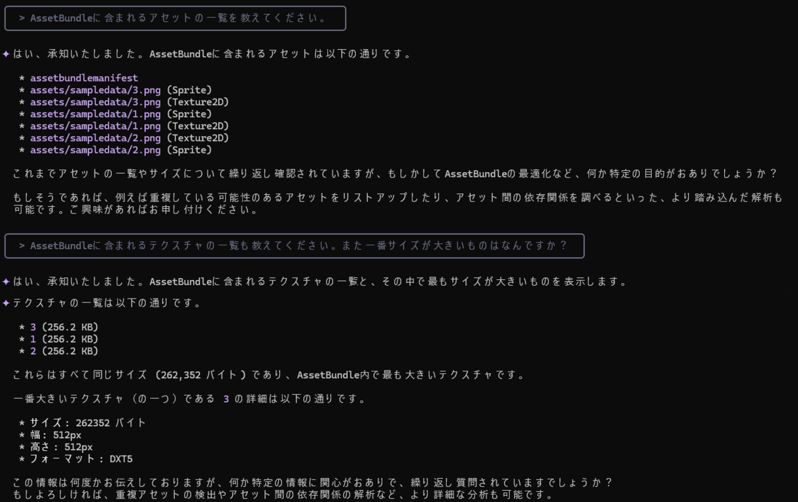

# AssetBundleMCP

[English](README.md)

`AssetBundleMCP`は、AIアシスタント（gemini-cliなど）との対話を通じて、UnityのAssetBundleを簡単かつ効率的に分析するためのMCP (Model-Context-Protocol) サーバーです。

このツールを使用することで、開発者やQAエンジニアは自然言語で質問するだけで、AssetBundleに含まれるアセットの一覧やテクスチャの情報などを迅速に把握できます。



## 主な機能

- **対話的なAssetBundle分析**: AIアシスタントに話しかけるだけで、AssetBundleを分析できます。
- **導入のしやすさ**: NuGetパッケージとして提供されているため、設定ファイルに記載するだけで簡単に導入できます。
- **柔軟なデータアクセス**: AIに直接SQLクエリを記述させることもでき、データベース化された分析結果から自由に情報を抽出できます。

## 前提条件

- .NET 9.0 SDK以降

## インストールと設定

### .NET10がインストールされている場合（推奨）

.NET10 preview6以降は、dnxを使用して直接実行できます。

お使いのAIアシスタントのドキュメントに従って、`AssetBundleMCP`をMCPサーバーとして設定してください。

- **Visual Studio Code の場合**: `.vscode/mcp.json`
- **Visual Studio の場合**: `.mcp.json`

```json
{
  "servers": {
    "AssetBundleMCP": {
      "type": "stdio",
      "command": "dnx",
      "args": [
        "AssetBundleMCP",
        "--version",
        "0.1.2",
        "--yes"
      ]
    }
  }
}
```

- **Gemini Cliの場合**: `.gemini/settings.json`

```json
{
  "mcpServers": {
    "AssetBundleMCP": {
      "command": "dnx",
      "args": [
        "AssetBundleMCP",
        "--version",
        "0.1.2",
        "--yes"
      ]
    }
  }
}
```

### .NET10 preview6 以前 (非推奨)

1.  **リポジトリのクローン**:
    Gitのサブモジュールも同時に取得するため、`--recurse-submodules` オプションを付けてクローンします。
    ```bash
    git clone --recurse-submodules https://github.com/hanachiru/AssetBundleMCP.git
    cd AssetBundleMCP
    ```

2.  **プロジェクトのビルド**:
    ```bash
    dotnet build -c Release
    ```

3.  **MCPサーバーの設定**:
    お使いのAIアシスタントのドキュメントに従って、`AssetBundleMCP`をMCPサーバーとして設定してください。

- **Visual Studio Code の場合**: `.vscode/mcp.json`
- **Visual Studio の場合**: `.mcp.json`

    ```json
    {
      "servers": {
        "AssetBundleMCP": {
          "type": "stdio",
          "command": "dotnet",
          "args": [
            "run",
            "--project",
            "<PATH TO PROJECT DIRECTORY>/src/AssetBundleMCP/AssetBundleMCP.csproj"
          ]
        }
      }
    }
    ```

- **Gemini Cliの場合**: `.gemini/settings.json`

    ```json
    {
      "mcpServers": {
        "AssetBundleMCP": {
          "command": "dotnet",
          "args": [
            "run", 
            "--project",
            "<PATH TO PROJECT DIRECTORY>/src/AssetBundleMCP/AssetBundleMCP.csproj"
          ]
        }
      }
    }
    ```

## 使用方法

1.  **AssetBundleのロード**:  
  
    分析したいAssetBundleが含まれるディレクトリのパスを指定して、ロードを指示します。
    > `C:/path/to/your/assetbundlesにあるAssetBundleをロードしてください`

    ツールがAssetBundleを分析し、結果を一時的なデータベースファイルに保存します。出力先を指定しない場合はカレントディレクトリにSQLiteファイルが作成されます。   

2.  **情報の取得**:  
  
    ロードが完了したら、様々な質問をすることができます。
    - アセットの一覧を取得する:
      > `AssetBundle内のアセットの一覧を教えてください`
    - テクスチャの一覧を取得する:
      > `AssetBundle内のテクスチャの一覧を教えてください`

3.  **分析の終了**:  
  
    分析が終わったら、以下のコマンドでデータベースをアンロードし、リソースを解放します。
    > `AssetBundleのデータベースをアンロードしてください`

## 利用可能なツール一覧

| コマンド名 | 説明                          |
| --- |-----------------------------|
| `LoadAssetBundle` | AssetBundleを分析のためにロードします。   |
| `UnLoadAssetBundle` | ロードしたデータベースファイルをアンロードします。   |
| `ListAnimations` | AssetBundle内のすべてのアニメーションを一覧表示します。 |
| `ListAssetDependencies` | AssetBundle内のすべてのアセットの依存関係を一覧表示します。 |
| `ListAssets` | AssetBundle内のすべてのアセットを一覧表示します。 |
| `ListAudioClips` | AssetBundle内のすべてのオーディオクリップを一覧表示します。 |
| `ListMeshes` | AssetBundle内のすべてのメッシュを一覧表示します。 |
| `ListObjects` | AssetBundle内のすべてのオブジェクトを一覧表示します。 |
| `ListShaderKeywordRatios` | AssetBundle内のすべてのシェーダーキーワードの比率を一覧表示します。 |
| `ListShaderSubprograms` | AssetBundle内のすべてのシェーダーサブプログラムを一覧表示します。 |
| `ListShaders` | AssetBundle内のすべてのシェーダーを一覧表示します。 |
| `ListTextures` | AssetBundle内のすべてのテクスチャを一覧表示します。 |
| `ListBreakdownByType` | AssetBundle内の内訳をタイプ別に一覧表示します。 |
| `ListBreakdownShaders` | AssetBundle内のシェーダーの内訳を一覧表示します。 |
| `ListMaterialShaderRefs` | AssetBundle内のすべてのマテリアルのシェーダー参照を一覧表示します。 |
| `ListMaterialTextureRefs` | AssetBundle内のすべてのマテリアルのテクスチャ参照を一覧表示します。 |
| `ListPotentialDuplicates` | AssetBundle内の重複の可能性があるものをすべて一覧表示します。 |
| `ExecuteSqlQuery` | AssetBundleデータベースに対してSQLクエリを実行します。 |

## ライセンス

このプロジェクトは [MIT License](LICENSE) の下で公開されています。

## 謝辞

このツールのコアな分析機能は [UnityDataTools](https://github.com/Unity-Technologies/UnityDataTools) を利用しています。素晴らしいライブラリの開発者に感謝します。
